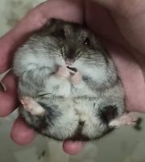
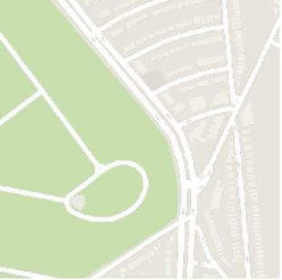
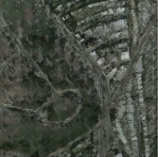
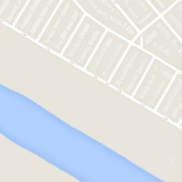
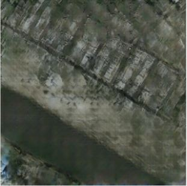
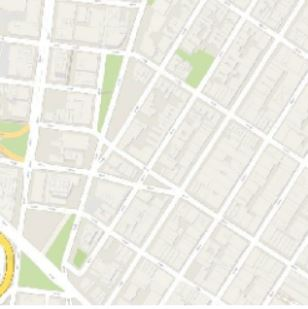
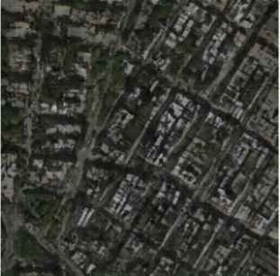

# TF2_DeepLearning_GenerativeModel
Here are some code examples of generative models, which are implemented with Tensorflow 2.4.0, results are shown as below: 

## Neural Style Transfer
| content image | style image | style transfer without variation loss | style transfer with variation loss|
|:-------------:|:-----------:|:-------------------------------------:|:--------------------------------:|
|||||

## Deep Dream
| original image | dreamt image | dreamt image with octave | dreamt image with scaling tiled and octave|
|:--------------:|:------------:|:------------------------:|:--------------------------------:|
|||||

## GAN
| DCGAN | WGAN | WGAN_GP |
|:-----:|:----:|:-------:|
||||

## Pix2Pix
| Input Images  | Predicted Image |
|:-------------:|:---------------:|
||
||
||

## Main References
* **Neural Style Transfer**
  * https://www.tensorflow.org/tutorials/generative/style_transfer

* **Deep Dream**
  * https://ai.googleblog.com/2015/06/inceptionism-going-deeper-into-neural.html
  * https://www.tensorflow.org/tutorials/generative/deepdream

* **GAN**
  * https://medium.com/coinmonks/celebrity-face-generation-using-gans-tensorflow-implementation-eaa2001eef86
  * https://nthu-datalab.github.io/ml/labs/14-2_GAN/14-2_GAN.html

* **Pix2Pix**
  * https://www.tensorflow.org/tutorials/generative/pix2pix
